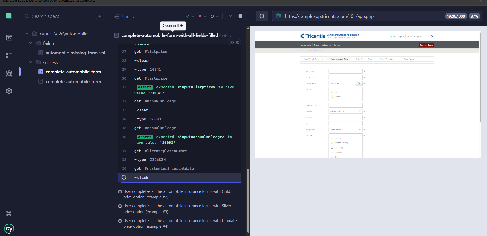
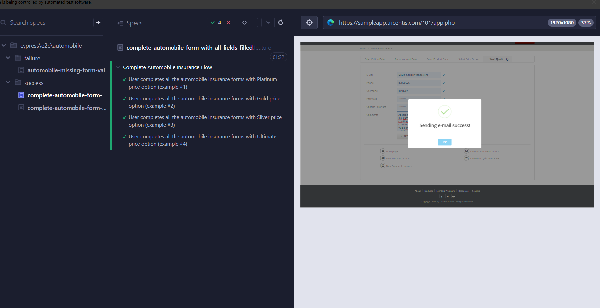

# 🚗 Projeto de Testes Automatizados - Academia Accenture 2025

Este projeto tem como objetivo automatizar cenários de teste para o fluxo de cotação de seguro no site [Tricentis Automóvel](https://sampleapp.tricentis.com/101/app.php), utilizando **Cypress + Cucumber (BDD)** com boas práticas de organização e manutenção de testes.

---

## 🛠️ Tecnologias Utilizadas

- [Cypress](https://www.cypress.io/) – Framework principal de automação.
- [Cypress-Cucumber-Preprocessor](https://github.com/badeball/cypress-cucumber-preprocessor) – Para escrita de testes em formato Gherkin (BDD).
- [Faker](https://github.com/faker-js/faker) – Para geração dinâmica de dados.
- Javascript (ES6)
- Node.js
- mocha reports

---

## 📁 Estrutura de Pastas

```
cypress/
│
├── e2e/                          # Features escritas em Gherkin (.feature)
│   └── automobile/
│       ├── success/              # Cenários positivos
│       └── failure/              # Cenários negativos
│
├── support/
│   ├── commands/                # Comandos customizados Cypress
│   ├── elements/                # Locators dos elementos por página
│   ├── factories/               # Geração de dados mockados
│   ├── pages/                   # Page Object Model
│   └── step_definitions/       # Steps BDD (ligação feature <-> comandos)
│
└── downloads/                   # Arquivos gerados (ex: PDF de confirmação)
```

---

## 🚀 Como Executar os Testes

clone o projeto:
```bash
git clone https://github.com/heyluannlucas/Academia_Accenture2025.git
```
```bash
cd Academia_Accenture2025
```


### 1. Instale as dependências:

```bash
npm install
```

### 2. Execute os testes com interface (modo interativo):

```bash
npx cypress open
```

### 3. Execute os testes com o report:

```bash
npm run test:repor
```

---

## 🧪 Estratégia de Testes

Os testes são divididos em três grupos principais:

### ✅ Cenários com todos os campos preenchidos (`@allFields`)
Testa o preenchimento completo dos formulários, incluindo campos opcionais.
### ✅ Cenários com apenas os campos obrigatórios (`@requiredOnly`)
Valida o fluxo mínimo funcional com preenchimento apenas dos campos obrigatórios.
### ❌ Cenários de validação de formulário (`@validation`)
Tenta enviar uma cotação sem preencher os formulários anteriores, verificando se os erros de validação aparecem corretamente.

---

## 📸 Exemplos Visuais

> Alguns testes rodando.

### 📍 Preenchimento do formulário:



### ✅ Mensagem de confirmação:




## 💡 Decisões Técnicas

- Utilizei **Page Object Model** com separação entre **locators (elements)** e **ações (commands)** para melhorar a manutenibilidade.
- Usei **factories** para gerar dados dinâmicos e desacoplar os testes de fixtures fixas.
- Os **steps BDD** estão organizados por contexto (`success` e `failure`) e utilizam comandos Cypress reutilizáveis.
- Organização pensada para **escalabilidade**: fácil adicionar novos módulos, como **“Truck”, “Motorcycle”** etc.

---

## 👩‍💻 Desenvolvido por

**Luann Lucas**  
*QA | Cypress + BDD + Automação de Testes*

---

## 📄 Licença

Este projeto é de uso educacional, desenvolvido como parte da Academia Accenture 2025.
